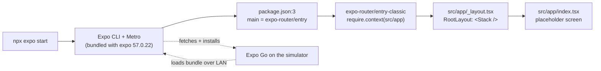
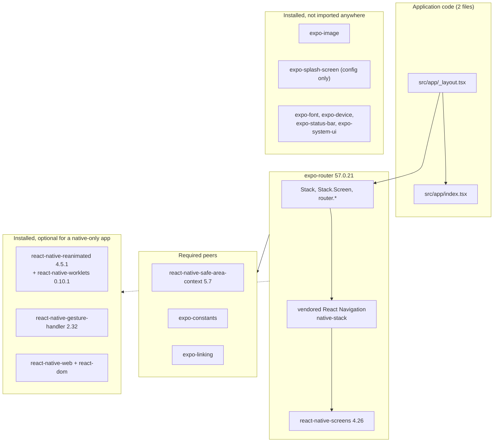

# How the app works today

Snapshot of the `feat/econsult-flow` worktree at commit `f39fb58`, before any feature work. Every claim below was checked on 2026-09-11 against the files in this repository, the installed packages under `node_modules`, or the versioned Expo documentation for SDK 57. Anything that could not be checked is marked **unverified**.

A rendered copy of this page lives at `specs/001-econsult-flow/artifacts/how-it-works.html`.

## What it does

Today the app is an empty Expo shell. It starts, shows a single screen with a placeholder sentence, and does nothing else. There is no e-consult flow, no data access, no fake backend and no test suite. What does exist is the skeleton the feature will be built into: file-based navigation with a native stack, TypeScript in strict mode, and the SDK 57 toolchain, all confirmed to run in Expo Go on the iOS simulator from a clean checkout.

## How it's wired

Walk-through:

1. `npx expo start` runs the Expo CLI that ships inside the `expo` package. In the smoke run on 2026-09-11 it printed `Using src/app as the root directory for Expo Router` and `React Compiler enabled`, then fetched and installed Expo Go on the iPhone 17 simulator and bundled 1263 modules.
2. `package.json:3` sets the JavaScript entry to `expo-router/entry`. That file imports `expo-router/entry-classic`, which mounts the router and builds the route tree from `require.context` over the app directory. The directory path is inlined at build time by `babel-preset-expo`'s router plugin.
3. The CLI prefers `src/app` over a root-level `app` directory when both could exist; only `src/app` is used here. `extra.router.root` in `app.json` could override that, but the project does not set it.
4. `src/app/_layout.tsx:3-5` is the root layout. It renders a native `Stack` from `expo-router` and nothing else: no providers, no fonts, no splash handling, no theme.
5. `src/app/index.tsx:3-9` is the only route. It renders a centred `Text` inside a flex `View`; the styles at `src/app/index.tsx:11-17` are the only styling in the app.

## Design & architecture

| Piece | Role today | Where |
|---|---|---|
| Root layout | Native stack navigator, no providers | `src/app/_layout.tsx:1-5` |
| Index route | Placeholder screen | `src/app/index.tsx:1-17` |
| App config | Name, slug and URL scheme `econsult`; portrait only; light and dark follow the OS; plugins `expo-router` and `expo-splash-screen`; experiments `typedRoutes` and `reactCompiler` both on | `app.json:3-9`, `app.json:26-40` |
| Android config | Adaptive icon assets; predictive back gesture disabled | `app.json:13-21` |
| TypeScript | Extends `expo/tsconfig.base`, `strict: true`, aliases `@/*` to `src/*` and `@/assets/*` to `assets/*`; includes the generated `.expo/types` and `expo-env.d.ts` | `tsconfig.json:2-19` |
| Dependencies | expo 57.0.22, expo-router 57.0.21, react 19.2.3, react-native 0.86.3, TypeScript 6.0.3 and the peers listed below; scripts `start`, `android`, `ios`, `web`, `lint` | `package.json:5-36` |
| Ignore rules | `node_modules`, `.expo`, `expo-env.d.ts`, generated `/ios` and `/android`, `.env*.local` | `.gitignore` |
| Agent guidance | `CLAUDE.md` includes `AGENTS.md`, whose only instruction is to read the versioned SDK 57 docs before writing code | `CLAUDE.md:1`, `AGENTS.md:1-3` |
| Editor and plugin config | Enables the official Expo Claude plugin; VS Code fixes and organises imports on save | `.claude/settings.json`, `.vscode/settings.json` |
| Assets | App icon, Android adaptive icon layers, splash icon, favicon | `assets/` |

Two facts about the package graph matter for later decisions. First, expo-router 57 vendors React Navigation and re-exports `ThemeProvider`, `DefaultTheme` and `DarkTheme` itself; there is no `@react-navigation/*` package in `node_modules`, so none should be added. Second, the three UI packages removed from the template (`@expo/ui`, `expo-glass-effect`, `expo-symbols`) are dependencies of expo-router itself and are still installed transitively, which is why removing them from `package.json` broke nothing.

## Helpers & building blocks

Installed and ready to use, none of them imported yet:

- **Navigation**: `Stack` with per-screen options such as `title`, `headerBackTitle`, `headerBackVisible` and `gestureEnabled`; imperative `router.replace`, `router.dismissAll`, `router.dismissTo`; `usePreventRemove` from `expo-router/react-navigation` for leave-screen guards. A nested `_layout.tsx` in a route group is the documented place for providers and context.
- **Safe areas**: `SafeAreaProvider`, `SafeAreaView` and `useSafeAreaInsets` from `react-native-safe-area-context`, a required peer of expo-router.
- **Images**: `expo-image` for rendering a picked photo.
- **Core React Native**: `Pressable`, `TextInput`, `ScrollView`, `KeyboardAvoidingView`, `AccessibilityInfo`, `PixelRatio.getFontScale`, `useWindowDimensions`.
- **Networking primitives**: on SDK 57 the global `fetch` is Expo's own implementation, installed by `node_modules/expo/src/winter/runtime.native.ts:40-52`; React Native's whatwg-fetch stays only when `EXPO_PUBLIC_USE_RN_FETCH=1`. It honours `AbortSignal`, but the rejection's shape depends on timing: a signal already aborted before the call throws `FetchError("fetch failed: The operation was aborted.", { cause: signal.reason })` (`expo/src/winter/fetch/fetch.ts:77-78`); an abort while the request is in flight cancels the native task, which rejects a pending start as `FetchError("fetch failed: Fetch request has been canceled")` with no `cause`, or, once headers have arrived, rejects the body read with `signal.reason` if set and otherwise a `DOMException` named `AbortError` (`expo/src/winter/fetch/FetchResponse.ts:183-189`, asserted by Expo's own tests). The abort-controller 3.0.0 polyfill has no `signal.reason`; only Expo's `timeout()` and `any()` set one. Its form-data conversion rejects React Native's `{ uri, name, type }` file part with "Unsupported FormDataPart implementation" (`expo/src/winter/fetch/convertFormData.ts:35-36,77`); a local file goes up through expo-file-system's `File.createUploadTask` or as a `File` object. `AbortController` is the abort-controller 3.0.0 polyfill, and Expo's runtime patches `AbortSignal.timeout` and `AbortSignal.any` onto it (`expo/src/winter/AbortSignal.ts:9-14`); `timeout()` aborts with a `TimeoutError` reason.
- **SDK modules bundled in Expo Go**: `expo-file-system 57.0.7` is already installed as a dependency of `expo`, though not declared in `package.json`; `expo-image-picker ~57.0.17`, `expo-image-manipulator ~57.0.17` and `expo-network ~57.0.2` are not installed but pinned in `expo/bundledNativeModules.json`, so `npx expo install` adds them without a development build.
- **Type safety**: strict TypeScript, path aliases, typed routes once generated.
- **React Compiler**: automatic memoisation of app code; it does not touch `node_modules`.

Not present yet: a test runner, an ESLint configuration (`npx expo lint` would generate one on first run), Prettier, a type-check script, environment variables (`.env*.local` is ignored but nothing reads one), and any state, data or API layer.

## Extension points & quirks

- **New screens are files.** A screen is a file under `src/app`; a group of screens gets its own directory with a `_layout.tsx`.
- **Typed routes are generated, not committed.** `expo-env.d.ts` and `.expo/types` appear only when the dev server runs or after `npx expo customize tsconfig.json`. On a clean clone `tsc --noEmit` runs before those exist. It passed on the blank app only because no typed `Href` is used yet; a type-check script must generate them first.
- **React Compiler is experimental.** It optimises function components in app code only, and code that mutates values during render is left alone or breaks its assumptions.
- **Expo Go ignores config-plugin permission strings.** Usage descriptions declared in `app.json` plugins only take effect in a prebuild or EAS build; Expo Go shows its own prompts. This is documented in the Expo permissions guide.
- **`gestureEnabled` is iOS only** and `headerBackVisible` has no effect on the first screen of a stack, so a confirmation screen that must not be left by going back needs a stack replace rather than a hidden button.
- **The iOS simulator has no camera**; the Android emulator has a virtual scene camera that can be fed a JPEG.
- **Managed workflow, no native folders.** `/ios` and `/android` are ignored; running `prebuild` would create them locally. CocoaPods is not installed on this machine, so `npx expo run:ios` is not available here without extra setup; Expo Go is the run path.
- **Two worktrees.** `Documents/econsult/main` tracks `main`; `Documents/econsult/feat-econsult-flow` tracks `feat/econsult-flow`, where all feature work happens.
- **Unverified**: whether a freshly created Android virtual device defaults its back camera to the virtual scene; whether Network Link Conditioner on the host shapes simulator traffic. Both are only relevant to manual testing.

## Sources

- Repository files listed in the table above, read at commit `f39fb58`.
- `node_modules/expo-router/package.json`, `build/exports.d.ts`, `build/global-state/router.d.ts`, `build/react-navigation/native-stack/types.d.ts` (expo-router 57.0.21).
- `node_modules/expo/bundledNativeModules.json` (expo 57.0.22).
- `node_modules/react-native/Libraries/Core/setUpXHR.js`, `Libraries/Network/FormData.js`, `node_modules/whatwg-fetch/dist/fetch.umd.js` (react-native 0.86.3).
- `node_modules/expo/src/winter/runtime.native.ts`, `src/winter/fetch/fetch.ts`, `src/winter/fetch/convertFormData.ts`, `src/winter/AbortSignal.ts` (expo 57.0.22); `node_modules/expo-file-system/build/File.d.ts` (expo-file-system 57.0.7).
- https://docs.expo.dev/router/reference/src-directory/ , https://docs.expo.dev/router/basics/layout/ , https://docs.expo.dev/router/reference/typed-routes/ , https://docs.expo.dev/guides/react-compiler/ , https://docs.expo.dev/guides/permissions/ , https://docs.expo.dev/versions/v57.0.0/sdk/imagepicker/ , https://docs.expo.dev/versions/v57.0.0/sdk/network/
